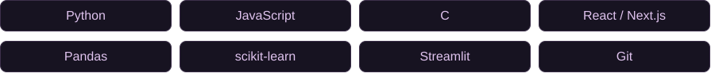

  

<h1 align="center">Hey there, I'm Juan 👋</h1>

  Building things that help people. 
  <strong>Software development · Data science · IT</strong>

  
  
  

---

### 🧑‍💻 About me

I enjoy connecting code, data, and practical problems—from forecasting sea levels to experimenting with Raspberry Pi projects.

- 🛠️ My projects span web development, machine learning, and data visualization.
- 📊 I like turning messy data into useful insights and interactive tools.
- 🍓 I enjoy experimenting with Raspberry Pi and building my IT skills.
- 🥾 Away from the keyboard: hiking, bowling, working out, and trying new recipes.

### 🧰 Tools I've worked with

  

### ✨ Featured work

| Project | What I built | Tools |
| :--- | :--- | :--- |
| **[Sea Level Rise Prediction](https://github.com/jzaval17/DATA-301/tree/main/proj1)** | Forecasting sea level trends from historical NOAA data, with an interactive dashboard for exploring predictions. | Python · Pandas · scikit-learn · Streamlit |
| **[Personal Portfolio](https://github.com/jzaval17/Juan-Portfolio)** | A home for my projects, experience, and background. | JavaScript · Next.js · CSS |
| **[Calculator in C](https://github.com/jzaval17/CalculatorProject)** | My first C program: a calculator for addition, subtraction, multiplication, and division. | C |

  
<strong>More projects from my portfolio</strong>

   

  **Tower Detection with Mask R-CNN** — Collaborated on satellite imagery preprocessing and machine learning for identifying towers, shadows, and buildings with CostQuest.

  **Pawsitive Studying** — Worked on backend development and user engagement analysis for a study application built with React Native/Expo, Express, MongoDB, and Azure.

  See the [project descriptions in my portfolio source](https://github.com/jzaval17/Juan-Portfolio/blob/master/app/components/Projects.js).

---

  <strong>Let's connect.</strong> 
  <a href="https://www.linkedin.com/in/jz805/">LinkedIn</a> ·
  <a href="mailto:jazavala805@gmail.com">Email</a> ·
  <a href="https://github.com/jzaval17?tab=repositories">Projects</a>

